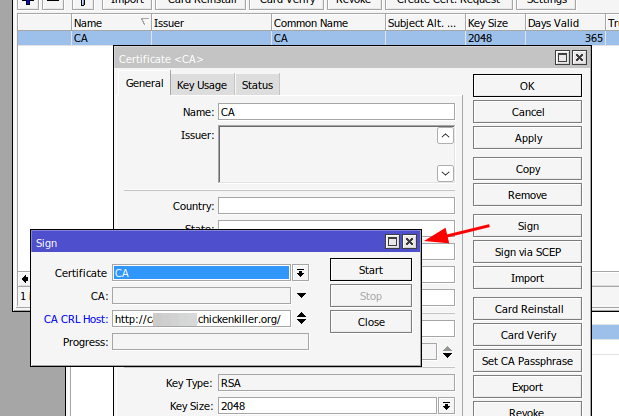
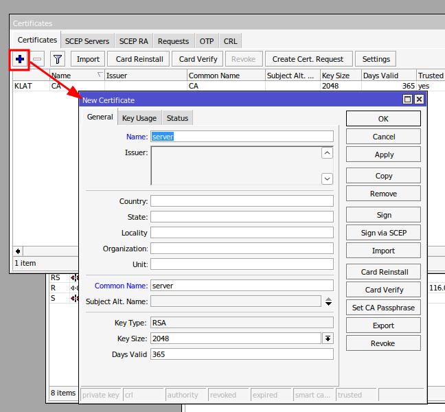
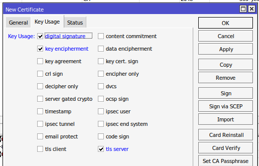
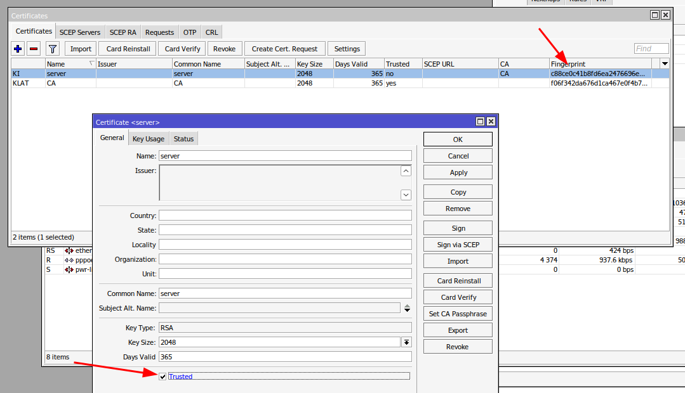
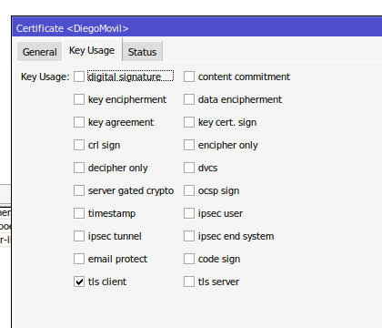
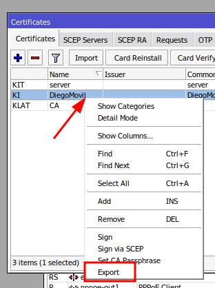
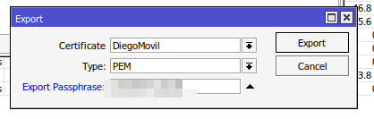
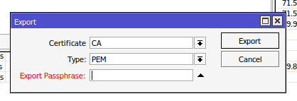

# Configurar un servidor OVPN en RuoterOS de Mikrotik

 Conocimientos previos

* 

## Crear los certificados

Firmamos usando un [DDNS](DDNS.md) como FreeDNS

Creamos el servidor

Firmamos el certificado del servidor con el CA.

Una vez firmado el servidor, aparece el checkbox para poder marcar el servidor como confiable.

Creamos el certificado del cliente, con las siguientes especificaciones y después los firmamos con el CA, igual que el servidor.

## Exportamos los certificados

Exportamos el certificado del cliente y del CA. 

> [!NOTE]
> Al exportar el del cliente le pondemos una clave, que se usará después al realizar la conexión desde el cliente, para poder usar este certificado.

El CA lo exportamos sin llave de paso.

